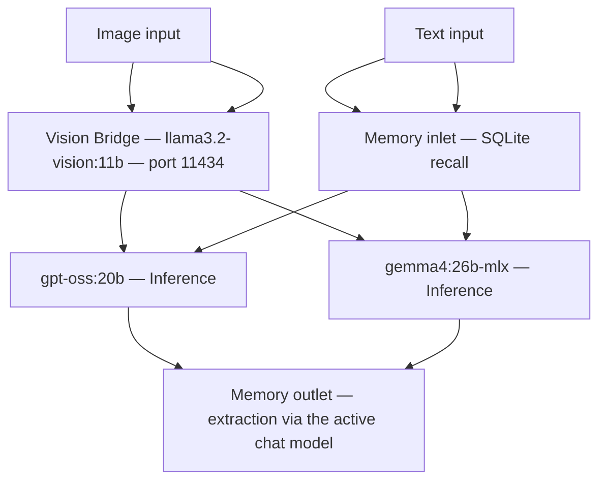
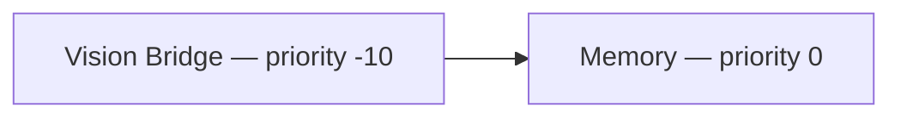

# macOS Local AI Stack

A fully automated, privacy-first AI assistant running entirely on your Mac.
No cloud API keys. No data leaving the machine. Everything offline after first setup.

---

## Inspiration

This project is independently designed and implemented. The following open-source projects
provided architectural ideas; no original code was copied or derived.

- [Open WebUI](https://github.com/open-webui/open-webui) by Timothy Baek — UI layer
- [adaptive_memory_v2](https://openwebui.com/f/alexgrama7/adaptive_memory_v2) by alexgrama7 — memory concept
- [local-vision-bridge](https://github.com/feliscat/local-vision-bridge) by feliscat — vision bridge concept

---

## Stack



### Filter execution order (both models)

Both `gpt-oss:20b` and `gemma4:26b-mlx` are text-only — neither can interpret
image bytes on its own — so both run the identical pipeline:



---

## Services

| Service | Port | Browser-facing? | Started by |
|---|---|---|---|
| HTTPS proxy (ssl-proxy.py) | 8443 | YES — this is the only entry point | start-open-webui.sh |
| Open WebUI | 8080 | No — internal HTTP backend | start-open-webui.sh |
| Ollama | 11434 | No | Ollama app |
| ChromaDB | 8000 | No | start-open-webui.sh |

Every service binds to 127.0.0.1 only — nothing is reachable from other machines.

### How access works (HTTPS only)

You always open the UI at **https://&lt;LOCAL_DOMAIN&gt;:8443** (for example
`https://ai.local:8443`).

```
Browser  --HTTPS-->  ssl-proxy.py (:8443)  --HTTP-->  Open WebUI (:8080, loopback)
```

- `ssl-proxy.py` (pure Python standard library, no dependencies) terminates TLS
  on port 8443 and forwards the bytes to Open WebUI's internal HTTP port.
- Open WebUI itself runs plain HTTP on 127.0.0.1:8080. That port is internal:
  the proxy and the provisioner use it, but you never open it in a browser.
- HTTPS is required because browsers only treat cookies as secure, and only
  grant access to APIs like clipboard paste, on a secure origin.

Want the clean URL `https://ai.local` with no `:8443`? See
[Using the standard port 443](#using-the-standard-port-443).

---

## Project layout

```
macos-local-ai-stack/
├── .env.example              # credentials and settings template
├── .gitignore
├── requirements.txt          # open-webui, chromadb
├── provision.py              # idempotent auto-setup (runs on every start)
├── setup-ssl.sh              # one-time TLS certificate setup (the only sudo step)
├── ssl-proxy.py              # HTTPS-to-HTTP proxy on :8443 (stdlib, no deps)
├── config/
│   └── model.env             # system prompt, user persona, model parameters
├── functions/
│   ├── memory.py             # filter: SQLite conversation recall (inlet) + log (outlet)
│   └── local-vision-bridge.py  # filter: image to text description (gpt-oss:20b only)
└── start-*.sh  stop-*.sh     # service lifecycle scripts
```

---

## Deploy

### Prerequisites

| Requirement | Install |
|---|---|
| macOS (Apple Silicon recommended) | — |
| Ollama | download from ollama.com |
| uv | `curl -LsSf https://astral.sh/uv/install.sh \| sh` |
| Python 3.11 | installed automatically by uv |
| mkcert | `brew install mkcert` |

mkcert issues the local HTTPS certificate the stack is served with.

### Step 1 — Clone

```bash
git clone <repo-url> /opt/macos-local-ai-stack
cd /opt/macos-local-ai-stack
sudo chown -R $(whoami) .
```

### Step 2 — Configure

```bash
cp .env.example .env
```

Edit `.env`:

```bash
WEBUI_ADMIN_EMAIL=you@example.com
WEBUI_ADMIN_PASSWORD=your-password
WEBUI_ADMIN_NAME=Your Name
LOCAL_DOMAIN=ai.local        # the hostname you will type in the browser
```

`setup-ssl.sh` (Step 5) maps `LOCAL_DOMAIN` to `127.0.0.1` in `/etc/hosts` and
includes it in the certificate. You then reach the UI at
`https://<LOCAL_DOMAIN>:8443`.

### Step 3 — Install dependencies

```bash
uv venv .venv --python 3.11
uv pip install -r requirements.txt --python ./.venv/bin/python
```

The virtualenv must be created in-place. Do not copy it from another directory.

### Step 4 — Pull models

```bash
ollama pull gpt-oss:20b          # primary chat model (~13 GB)
ollama pull llama3.2-vision:11b  # image understanding for gpt-oss:20b (~8 GB)
ollama pull gemma4:26b-mlx       # secondary model, text-only (~17 GB)
```

### Step 5 — Set up HTTPS (required)

The stack is served over HTTPS only, so this step is mandatory. It is the only
step that needs `sudo`.

```bash
brew install mkcert
./setup-ssl.sh
```

`setup-ssl.sh` installs a local Certificate Authority into your macOS keychain,
issues a certificate for `127.0.0.1`, `localhost`, and your `LOCAL_DOMAIN`, and
adds the `LOCAL_DOMAIN` entry to `/etc/hosts`. Read
[What setup-ssl.sh does](#what-setup-sslsh-does) before running it.

### Step 6 — Start

```bash
./start-open-webui.sh
```

This needs **no sudo**. On first boot Open WebUI runs database migrations
(about a minute). The script starts everything and launches the provisioner
in the background. Follow progress with:

```bash
tail -f ./data/provision.log
# Ready when you see: Provisioning complete.
```

Then open:

```
https://<LOCAL_DOMAIN>:8443      e.g. https://ai.local:8443
```

(or `https://127.0.0.1:8443`). Sign in with the email and password from `.env`.

### Stop

```bash
./stop-open-webui.sh
```

---

## Automatic provisioning

`provision.py` runs after every start. Every step is idempotent.

| Step | What |
|---|---|
| Admin account | Created from `.env` on first boot (written directly to SQLite) |
| Memory filter | Installed from `functions/memory.py` |
| Vision Bridge | Installed from `functions/local-vision-bridge.py`, priority -10 |
| Filter order (gpt-oss:20b) | vision bridge → memory |
| Filter order (gemma4:26b-mlx) | vision bridge → memory (text-only, same as gpt-oss) |
| Memory toggle | Enabled for every user account |
| Model params | Applied from config/model.env to both models |

All steps are written directly to SQLite — no authenticated API calls required.

---

## Memory system

### How it works

The memory filter extracts compact facts from your messages and stores them in
Open WebUI's SQLite database. Extraction always uses **whichever model is
serving the active chat** — `gpt-oss:20b` when you're talking to gpt-oss,
`gemma4:26b-mlx` when you're talking to gemma. That model is already resident
in unified memory, so extraction adds only a small second-call latency and
never forces a second large model to load alongside the one you're chatting
with.

**Inlet (before each turn):**
- Loads up to 8 `[USER]` facts (profile, tools, preferences — persistent across sessions)
- Loads up to 4 `[CHAT:<id>]` facts (context specific to the current thread)
- Injects them as a `MEMORY:` block at the start of the system prompt

**Outlet (after each turn):**
- Calls the active chat model with a focused extraction prompt
- Extracts explicit self-declarations: "I am ...", "I use ...", "I work on ...", etc.
- Saves new facts to SQLite; replaces contradicting facts
- Emits a status in the UI showing what was stored

### Manual user facts

Add permanent facts about yourself in Open WebUI → Settings → Personalization → Memory.
These are stored as `[USER]` rows and appear in every conversation regardless of topic.

### Memory status messages

| Message | Meaning |
|---|---|
| Memory: +N stored | N new facts extracted and saved |
| Memory: N updated | N facts replaced (contradiction with stored memory) |
| Memory: nothing new | No self-declarations found in the message |
| (no status) | User message was too short (< 8 chars) |

### Memory test

```
# Chat 1
I am a senior iOS developer. My main stack is Swift and SwiftUI.
# Expected status: "Memory: +2 stored"

# New chat — verify recall
What do you know about me from our past conversations?
# Expected: model mentions iOS developer, Swift, SwiftUI
```

### Inspecting stored memory

Memory facts live in two places. The SQLite table is the source of truth; the
ChromaDB collection is an optional semantic-search mirror.

**1. Open WebUI's SQLite `memory` table** — every fact the filter saves or
recalls comes from here, tagged `[USER]` (applies to every conversation) or
`[CHAT:<chat-id>]` (specific to one thread). Stop the stack first
(`./stop-open-webui.sh`) to avoid reading mid-write, or open the DB read-only.

```bash
# Find your user_id and any chat_id you care about
sqlite3 ./data/webui.db "SELECT id, email FROM user;"
sqlite3 ./data/webui.db "SELECT id, title FROM chat WHERE user_id = '<user-id>';"

# All memories for that user, newest first, tier visible in the prefix
sqlite3 ./data/webui.db "
  SELECT content, datetime(updated_at, 'unixepoch')
  FROM memory
  WHERE user_id = '<user-id>'
  ORDER BY updated_at DESC;
"

# Only [USER] facts (persist across every chat)
sqlite3 ./data/webui.db "
  SELECT content FROM memory
  WHERE user_id = '<user-id>' AND content LIKE '[USER]%';
"

# Only facts scoped to one chat thread (id is the last path segment of the chat URL)
sqlite3 ./data/webui.db "
  SELECT content FROM memory
  WHERE user_id = '<user-id>' AND content LIKE '[CHAT:<chat-id>]%';
"
```

**2. ChromaDB `user_memory` collection** — written best-effort whenever the
Memory filter's `embedding_model` valve is set (it is empty by default, so this
collection normally stays empty and the SQLite table above is the complete
picture). Query it directly over Chroma's REST API:

```bash
# Resolve the collection's internal ID
curl -s http://127.0.0.1:8000/api/v2/collections/user_memory | python3 -m json.tool

# Dump every stored document + metadata (substitute the id from the call above)
curl -s -X POST http://127.0.0.1:8000/api/v2/collections/<collection-id>/get \
  -H 'Content-Type: application/json' \
  -d '{"include": ["documents", "metadatas"]}' \
  | python3 -m json.tool
```

---

## Vision

Both `gpt-oss:20b` and `gemma4:26b-mlx` are **text-only** models — neither can
interpret raw image bytes. Every image attachment is intercepted by the Local
Vision Bridge filter before the LLM sees it. The bridge calls
`llama3.2-vision:11b` and returns a structured description:

```
TEXT: any visible text copied verbatim, or "none"
DESCRIPTION: detailed visual description
```

The model receives this text in place of the image — drag-and-drop, clipboard
paste (Cmd+V), and the file picker all work, since the bridge handles every
content format Open WebUI produces (see `functions/local-vision-bridge.py`).

---

## Voice (not supported)

This stack does not configure or support voice input/output. `gpt-oss:20b` and
`gemma4:26b-mlx` are text models — routing speech through them via STT/TTS adds
latency and complexity for no benefit. The provisioner does not touch Open
WebUI's audio settings; if you enable the microphone or TTS engine yourself in
**OWU Settings → Audio**, you are on your own — restarts may not preserve your
choices, since the provisioner does not manage them.

---

## HTTPS

### What setup-ssl.sh does

Read this before running. It is the only script that uses `sudo`.

1. Creates a local Certificate Authority (CA) with mkcert and installs it into
   your macOS System Keychain (sudo). Safari and Chrome then trust the
   certificate — no "Not Secure" warning.
2. Issues a certificate for `127.0.0.1`, `localhost`, and your `LOCAL_DOMAIN`,
   stored in `ssl/` (outside `data/`, so it survives a data reset).
3. Adds `127.0.0.1 <LOCAL_DOMAIN>` to `/etc/hosts` (sudo) so the name resolves.

Security implications — understand these before installing a CA:

- The mkcert CA is added to your system keychain. Any certificate signed by it
  is trusted by Safari and Chrome **on this machine only**.
- The CA private key lives at `$(mkcert -CAROOT)/rootCA-key.pem`. Anyone who
  obtains that key could sign certificates your Mac would trust. Keep it private.
- The CA cannot sign certificates for public-internet domains. It is local-only.
- To remove it completely: `mkcert -uninstall`

After setup, `start-open-webui.sh` runs the HTTPS proxy on port 8443 with no
sudo. All services bind to `127.0.0.1` only.

### Using the standard port 443

By default you access the UI at `https://ai.local:8443`. If you want the clean
URL `https://ai.local` (no port number), put a reverse proxy in front that
listens on 443 and forwards to the stack's proxy on 8443 (or directly to Open
WebUI on 8080). Binding to 443 requires root, which is why it is not done
automatically.

Two common options:

Option A — Caddy (simplest, automatic local TLS):

```
# /opt/homebrew/etc/Caddyfile
ai.local {
    reverse_proxy 127.0.0.1:8080
}
```

```bash
brew install caddy
sudo caddy run --config /opt/homebrew/etc/Caddyfile
```

Caddy terminates TLS itself, so you can point it at the plain HTTP backend
(`127.0.0.1:8080`) and skip this project's `ssl-proxy.py` and `setup-ssl.sh`
entirely if you prefer Caddy to manage certificates.

Option B — macOS pf port forwarding (443 to 8443):

```bash
echo "rdr pass on lo0 inet proto tcp from any to 127.0.0.1 port 443 -> 127.0.0.1 port 8443" \
    | sudo pfctl -ef -
```

This reuses this project's HTTPS proxy and certificate; only the port mapping
needs root. Note that pf rules are cleared on reboot.

If you use either option, add the bare `https://<LOCAL_DOMAIN>` origin to
`CORS_ALLOW_ORIGIN` in `start-open-webui.sh`.

---

## Customising model behaviour

Edit `config/model.env` and restart. The provisioner applies it on every boot.

| Key | What it controls |
|---|---|
| SYSTEM_PROMPT | System message injected before every chat. Use {USER_PERSONA}. |
| SYSTEM_USER_PERSONA | Your role and context, merged into {USER_PERSONA}. |
| MODEL_TEMPERATURE | 0.0 is deterministic, 1.0 is creative. Default 0.3. |
| MODEL_TOP_P | Nucleus sampling cutoff. Default 0.85. |
| MODEL_MAX_TOKENS | Max tokens per reply. Default 2048. |

For a temporary change in one session, start a message with:

```
[System: For this conversation, act as a database performance expert.]
```

---

## Logs

```bash
tail -f ./data/webui.log       # Open WebUI and provisioner
tail -f ./data/ssl-proxy.log   # HTTPS proxy
tail -f ./data/chromadb.log    # ChromaDB (vector memory store)
tail -f ./data/provision.log   # auto-configuration on each start
```

---

## Security

- All services bind to `127.0.0.1` only — unreachable from other machines.
- The browser only ever uses HTTPS on port 8443. Open WebUI's HTTP port 8080
  is loopback-internal (used by the proxy and provisioner, never advertised).
- CORS is locked to the HTTPS origins only (semicolon-separated for Open WebUI).
- `.env` and `ssl/` are git-ignored — credentials and the private key are
  never committed.
- Telemetry disabled: `SCARF_NO_ANALYTICS=true`, `DO_NOT_TRACK=true`.
- The mkcert CA is local-only and cannot sign public certificates.

---

## Upgrading

```bash
./stop-open-webui.sh
git pull
uv pip install -r requirements.txt --python ./.venv/bin/python
./start-open-webui.sh
```

Data in ./data/ is not touched by upgrades.

---

## Reset

To wipe all chats, users, and memories and start fresh:

```bash
./stop-open-webui.sh
rm -rf ./data
./start-open-webui.sh
```

The TLS certificate lives in `ssl/` (not `data/`), so it survives a reset — no
need to re-run `setup-ssl.sh`. The provisioner recreates the admin account and
all configuration on the next start.

---

## Uninstall

```bash
./stop-open-webui.sh
mkcert -uninstall 2>/dev/null || true
sudo rm -rf /opt/macos-local-ai-stack
```
